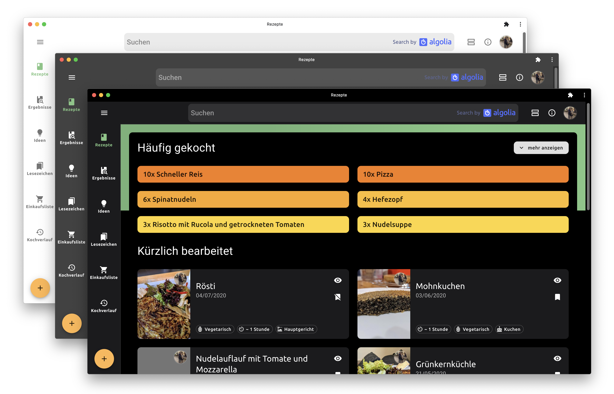

# RecipeHandler-4.0

> collect and share recipes  
> A running version of this app can be found here: https://recipehandler.web.app/

___

# ReadMe

## Getting started

1. clone this repo
1. install [nodejs](https://nodejs.org/en/)
1. install [vs code](https://code.visualstudio.com/) and the following plugins: [(1)](https://marketplace.visualstudio.com/items?itemName=esbenp.prettier-vscode), [(2)](https://marketplace.visualstudio.com/items?itemName=dbaeumer.vscode-eslint), [(3)](https://marketplace.visualstudio.com/items?itemName=vscodeshift.material-ui-snippets)
1. navigate into the root dir of the cloned repo and `npm install` via your prefered shell
1. to start the webapp run `npm start`
